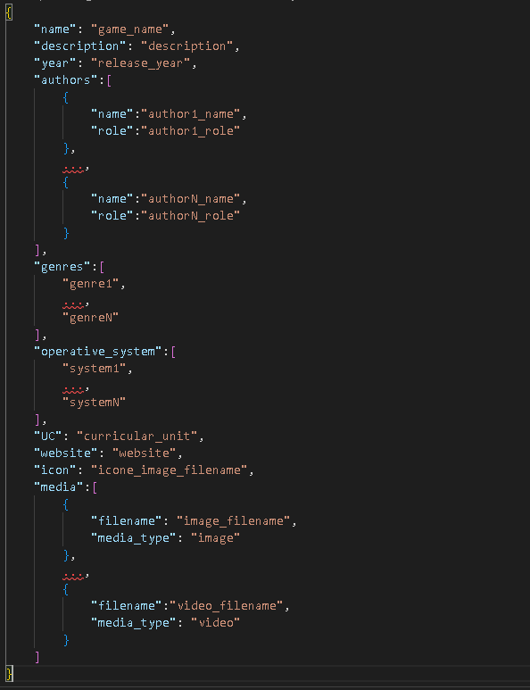

# Games information and Data Treatment

In this document we will talk about the information we need to retrieve from a game to be fully added to the arcade, the way you deliver that data and how we are going to validate/integrate it.

We strongly advise to read this document if you have a work that is supposed to work in this project.

- [Games information and Data Treatment](#games-information-and-data-treatment)
  - [Retrived Information](#retrived-information)
  - [How to deliver the information](#how-to-deliver-the-information)
  - [File Structure](#file-structure)
  - [Data treatment](#data-treatment)
    - [Name](#name)
    - [Description](#description)
    - [Release Year](#release-year)
    - [Authors](#authors)
    - [Genre](#genre)
    - [Operative System](#operative-system)
    - [Curricular Unit](#curricular-unit)
    - [Website](#website)
    - [Icon](#icon)
    - [Extra media](#extra-media)

## Retrived Information

The information we plan to retrieve are the game's:

- Name
- Release Year
- Authors and their role in the project
- Genres
- Operative system(s)
- Curricular unit
- Website
- Description
- Icon
- Media - can be or images or video to complement game apresentation

## How to deliver the information

The way we decided to retrieve the information is from a JSON document.
The game makers should create a JSON which name convention is ```info.json```.
For all the informtion that is related to some kind of media like images or video, we desire that you place it all in a directory called _media_.

Here follows an template of the required _info.json_:



For example, we are going to show an example for the following game and its attributes:

- Name: PE_Game
- Description: Love games!
- Release Year: 2001
- Authors and their role in the project: Diogo Maia, Developer; Pedro Joaquim, Animator
- Genres: Action; Platform
- Operative system(s): Windows
- Curricular unit: CGRA
- Website: www.pe_game.pt
- Icon: icon.png
- Media: screenshot1.png (image); screenshot2.png (image); video1.vid (video)


**Important**

- Games that dont have a _info.json_ will not be processed and included on the arcade.
- Any aditional attributes added on the JSON will not be considered, i.e, if you decide to add ```"like"="3"``` on your info.json, we will not read it and assume it does not exist.
- We will expect that any file inserted exists. If you make a mistake on that, such element will not be counted. You must add at most 3 extra media.


## File Structure

In this topic we will informe you how we want all the information relative to the game to be organized in a way that makes it easier for you to fill it and us to read it.

The file strcture should be as follows:


where _game data_ is where you place all game data related files, _media_ is where you place all images/videos we need to read or more if you desire, _game.exe_ is the game's executable and _info.json_ is the file from which we will read all information.

If the file system does not have a _media_ directory, the attributes _media_ and _icon_ will not be read.

## Data treatment

In this topic we will explain how we will validate each topic of the received information, assuming the information file is in a valid format.
### Name

The game's name information hasn't any validation requirements. All we expect is for the name to not surpass an upper limit 108 characters.

### Description

The game's description hasn't any validation requeirements. All we expect is for the description to not surpass an upper limit of 512 characters.

### Release Year

The game's release year needs to be on numerical form (i.e 2010 or 1994) and years after the current year and before 1980 won't be accepted, and the game's year will be declared as the current year.

### Authors

The authors' names won't suffer any validation besides an upper limit of 108 characters.
The roles you decide will not suffer from any validation. However, we strongly do not recommend for offensive names or something out of the normal. It will be noticed and you can be punished.

### Genre

The game's genre(s) need(s) to be of the following:

- Action
- Adventure
- Action-Adventure
- Puzzle
- Role-Playing
- Simulation
- Strategy
- Sports
- Sandbox
- Singleplayer
- Coop
- Others

**Important**

- Any input that isn't on this list will be discarded.
- If there is no valid input, the game will be declared of the 'Others' genre.

### Operative System

The game's operative system(s) need(s) to be of the following:

- Windows
- IOS
- Mac OS
- Android
- Linux
- Not defined

**Important**

- Any input that isn't on this list will be discarded.
- If there is no valid input, the game will not be avaiable to play and be stated as unplayable on the Arcade with 'Not defined' as its operative system.

### Curricular Unit

The game's curricular unit must be from this list:

- CGRA
- LCOM
- DJCO
- JDMM  
- DDJD
- LAIG
- SGI
- Others


### Website

There are not any plans to validate the website input.

### Icon

The game's icon must be on a directory called _media_ with all the extra media used to promote your work.
The text on the _json_ must be |filename|.|filetype|.
We will only verify if the file exists and use it.

**Important**

If you do not provide any icon or an invalid icon, we will use a default one selected by us.

### Extra media

The game's extra media must be on a directory called _media_ with its icon.
The input on the _json_ must be a list of media with a _filename_ like |filename|.|filetype| and a _mediatype_ which must be one of the following: {image, video}.
We will only verify if the files exist.

**Important**

If you provide a media type that does not belong to the set provided, such media will not be considered.
If you fail to provide any valid media or to provide one at all, the game will have no type of extra representation besides the icon and description.


Go back to main page: [Main Page](../README.md)
